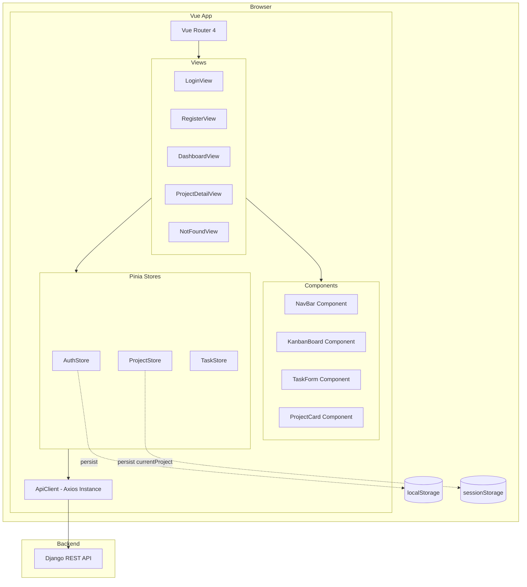
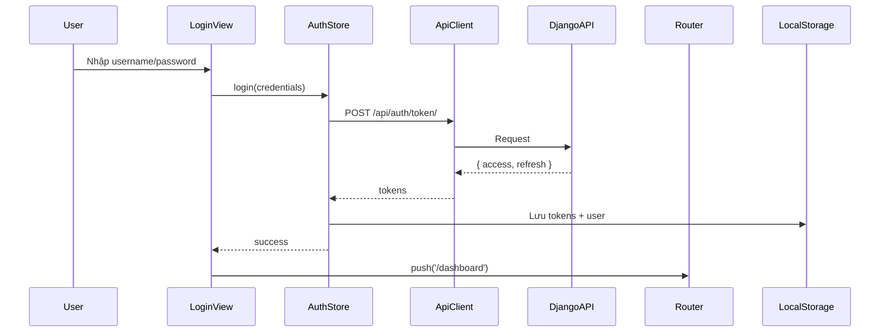
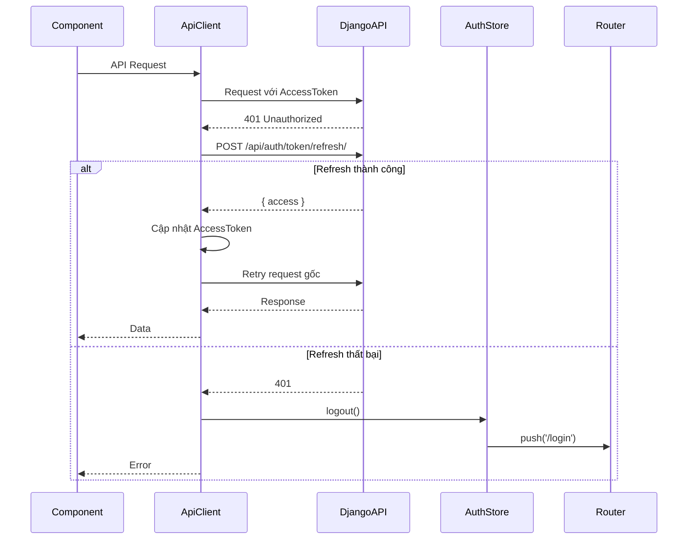

# Tài Liệu Thiết Kế: Vue 3 Frontend Setup

## Tổng Quan

Tài liệu này mô tả thiết kế kỹ thuật cho ứng dụng frontend quản lý dự án (Project Management App) xây dựng trên Vue 3 + Vite. Ứng dụng tích hợp với Django REST API backend thông qua JWT authentication, cung cấp giao diện Kanban board và table view để quản lý dự án và công việc.

Dự án hiện tại đã có cấu trúc cơ bản với Vue 3, Vite, Vue Router 4 và Pinia. Thiết kế này mở rộng cấu trúc đó để đáp ứng đầy đủ các yêu cầu nghiệp vụ.

### Công Nghệ Sử Dụng

| Thành phần | Công nghệ | Phiên bản |
|---|---|---|
| Framework | Vue 3 | ^3.5.x |
| Build tool | Vite | ^8.x |
| Router | Vue Router | ^5.x |
| State management | Pinia | ^3.x |
| HTTP client | Axios | ^1.x |
| UI Library | Element Plus | ^2.x |
| Form validation | VeeValidate + Yup | ^4.x + ^1.x |
| State persistence | pinia-plugin-persistedstate | ^4.x |
| Drag & drop | Vue Draggable (SortableJS) | ^4.x |
| Testing | Vitest + Vue Test Utils | ^3.x |
| PBT Library | fast-check | ^3.x |

**Lý do chọn Element Plus:** Hệ sinh thái Vue 3 native, hỗ trợ TypeScript tốt, có đầy đủ component cần thiết (Dialog, Table, Form, Toast, Kanban-friendly layout), tài liệu tiếng Anh và tiếng Trung phong phú.

---

## Kiến Trúc

### Sơ Đồ Kiến Trúc Tổng Thể



### Luồng Xác Thực (Authentication Flow)



### Luồng Token Refresh



---

## Cấu Trúc Thư Mục

```
src/
├── assets/
│   ├── base.css
│   ├── main.css
│   └── logo.svg
├── components/
│   ├── common/
│   │   ├── AppNavBar.vue          # Navigation bar toàn cục
│   │   ├── AppSidebar.vue         # Sidebar navigation
│   │   ├── LoadingSpinner.vue     # Loading spinner
│   │   └── SkeletonCard.vue       # Skeleton loading card
│   ├── project/
│   │   ├── ProjectCard.vue        # Card hiển thị dự án
│   │   └── ProjectForm.vue        # Form tạo/chỉnh sửa dự án
│   └── task/
│       ├── KanbanBoard.vue        # Kanban board component
│       ├── KanbanColumn.vue       # Một cột trong Kanban
│       ├── TaskCard.vue           # Card hiển thị task
│       ├── TaskForm.vue           # Form tạo/chỉnh sửa task
│       └── TaskTable.vue          # Table view cho tasks
├── composables/
│   ├── useAuth.js                 # Composable cho auth logic
│   ├── useProjects.js             # Composable cho project operations
│   └── useTasks.js                # Composable cho task operations
├── router/
│   └── index.js                   # Cấu hình Vue Router + guards
├── services/
│   └── apiClient.js               # Axios instance + interceptors
├── stores/
│   ├── auth.js                    # AuthStore (Pinia)
│   ├── projects.js                # ProjectStore (Pinia)
│   └── tasks.js                   # TaskStore (Pinia)
├── utils/
│   ├── validators.js              # Yup validation schemas
│   └── errorHandler.js            # Xử lý lỗi tập trung
├── views/
│   ├── auth/
│   │   ├── LoginView.vue
│   │   └── RegisterView.vue
│   ├── DashboardView.vue
│   ├── ProjectDetailView.vue
│   └── NotFoundView.vue
├── App.vue
└── main.js
```

---

## Các Thành Phần và Giao Diện

### 1. ApiClient (`src/services/apiClient.js`)

Module trung tâm xử lý tất cả HTTP communication với Django REST API.

```javascript
// Giao diện ApiClient
const apiClient = axios.create({
  baseURL: import.meta.env.VITE_API_BASE_URL,
  timeout: 30000,
  headers: { 'Content-Type': 'application/json' }
})

// Request interceptor: đính kèm AccessToken
apiClient.interceptors.request.use(config => {
  const token = localStorage.getItem('accessToken')
  if (token) config.headers.Authorization = `Bearer ${token}`
  return config
})

// Response interceptor: xử lý 401 và chuẩn hóa lỗi
apiClient.interceptors.response.use(
  response => response,
  async error => {
    // Xử lý 401: refresh token và retry
    // Xử lý các lỗi khác: chuẩn hóa thành { status, message, errors }
  }
)
```

**Cấu trúc Error Object chuẩn hóa:**
```javascript
{
  status: 404,           // HTTP status code
  message: "Not found",  // Thông báo lỗi chính
  errors: {}             // Chi tiết lỗi validation (nếu có)
}
```

### 2. AuthStore (`src/stores/auth.js`)

```javascript
// State
{
  user: null,              // { id, username, email }
  accessToken: null,       // JWT access token
  refreshToken: null,      // JWT refresh token
  isAuthenticated: false,
  isLoading: false,
  error: null
}

// Actions
login(credentials)         // POST /api/auth/token/
register(userData)         // POST /api/auth/register/
logout()                   // Xóa tokens, redirect /login
refreshAccessToken()       // POST /api/auth/token/refresh/

// Persist config
persist: {
  storage: localStorage,
  paths: ['user', 'accessToken', 'refreshToken', 'isAuthenticated']
}
```

### 3. ProjectStore (`src/stores/projects.js`)

```javascript
// State
{
  projects: [],            // Project[]
  currentProject: null,    // Project | null
  isLoading: false,
  error: null,
  pagination: {
    page: 1,
    pageSize: 20,
    total: 0
  }
}

// Actions
fetchProjects()            // GET /api/projects/
fetchProjectById(id)       // GET /api/projects/:id/
createProject(data)        // POST /api/projects/
deleteProject(id)          // DELETE /api/projects/:id/

// Getters
projectById: (id) => Project | undefined

// Persist config
persist: {
  storage: sessionStorage,
  paths: ['currentProject']
}
```

### 4. TaskStore (`src/stores/tasks.js`)

```javascript
// State
{
  tasks: [],               // Task[]
  currentTask: null,       // Task | null
  isLoading: false,
  error: null
}

// Actions
fetchTasks(projectId)      // GET /api/projects/:id/tasks/
createTask(projectId, data) // POST /api/projects/:id/tasks/
updateTask(taskId, data)   // PUT /api/tasks/:id/
patchTask(taskId, data)    // PATCH /api/tasks/:id/ (dùng cho drag & drop)
deleteTask(taskId)         // DELETE /api/tasks/:id/

// Getters
tasksByStatus: (status) => Task[]
```

### 5. Vue Router (`src/router/index.js`)

```javascript
const routes = [
  { path: '/login',    name: 'login',    component: LoginView },
  { path: '/register', name: 'register', component: RegisterView },
  {
    path: '/dashboard',
    name: 'dashboard',
    component: () => import('@/views/DashboardView.vue'),
    meta: { requiresAuth: true, title: 'Dashboard' }
  },
  {
    path: '/projects/:id',
    name: 'project-detail',
    component: () => import('@/views/ProjectDetailView.vue'),
    meta: { requiresAuth: true, title: 'Chi tiết dự án' },
    children: [
      { path: 'tasks/:taskId', name: 'task-detail', ... }
    ]
  },
  { path: '/404', name: 'not-found', component: NotFoundView },
  { path: '/:pathMatch(.*)*', redirect: '/404' }
]

// Navigation Guard
router.beforeEach((to, from) => {
  const authStore = useAuthStore()
  if (to.meta.requiresAuth && !authStore.isAuthenticated) {
    return { name: 'login' }
  }
  if ((to.name === 'login' || to.name === 'register') && authStore.isAuthenticated) {
    return { name: 'dashboard' }
  }
})

// Title update
router.afterEach((to) => {
  document.title = to.meta.title ?? 'Project Manager'
})
```

### 6. KanbanBoard Component

```
KanbanBoard
├── Props: tasks (Task[]), isLoading (boolean)
├── Emits: task-moved (taskId, newStatus)
└── Children:
    ├── KanbanColumn [status="todo"]
    │   └── TaskCard[] (draggable)
    ├── KanbanColumn [status="in_progress"]
    │   └── TaskCard[] (draggable)
    └── KanbanColumn [status="done"]
        └── TaskCard[] (draggable)
```

### 7. TaskForm Component

```
TaskForm
├── Props: task (Task | null), projectId (string), mode ('create' | 'edit')
├── Emits: submit (taskData), cancel
└── Fields:
    ├── title: string (required, max 200)
    ├── description: string (optional)
    ├── status: 'todo' | 'in_progress' | 'done' (required)
    ├── priority: 'low' | 'medium' | 'high' (required)
    └── assignee: string (optional)
```

---

## Mô Hình Dữ Liệu

### Project

```javascript
/**
 * @typedef {Object} Project
 * @property {number} id
 * @property {string} name
 * @property {string} description
 * @property {string} created_at  // ISO 8601
 * @property {string} updated_at  // ISO 8601
 */
```

### Task

```javascript
/**
 * @typedef {Object} Task
 * @property {number} id
 * @property {string} title
 * @property {string} description
 * @property {'todo' | 'in_progress' | 'done'} status
 * @property {'low' | 'medium' | 'high'} priority
 * @property {string | null} assignee
 * @property {number} project_id
 * @property {string} created_at  // ISO 8601
 * @property {string} updated_at  // ISO 8601
 */
```

### User

```javascript
/**
 * @typedef {Object} User
 * @property {number} id
 * @property {string} username
 * @property {string} email
 */
```

### ErrorObject (chuẩn hóa từ ApiClient)

```javascript
/**
 * @typedef {Object} ErrorObject
 * @property {number} status
 * @property {string} message
 * @property {Object} errors  // { fieldName: string[] }
 */
```

### Yup Validation Schema cho TaskForm

```javascript
const taskSchema = yup.object({
  title: yup.string()
    .required('Tiêu đề không được để trống')
    .max(200, 'Tiêu đề không được vượt quá 200 ký tự'),
  description: yup.string().optional(),
  status: yup.string()
    .oneOf(['todo', 'in_progress', 'done'], 'Trạng thái không hợp lệ')
    .required('Trạng thái là bắt buộc'),
  priority: yup.string()
    .oneOf(['low', 'medium', 'high'], 'Độ ưu tiên không hợp lệ')
    .required('Độ ưu tiên là bắt buộc'),
  assignee: yup.string().optional().nullable()
})
```

---

## Correctness Properties

*Một property là đặc tính hoặc hành vi phải đúng trong tất cả các lần thực thi hợp lệ của hệ thống — về cơ bản là một phát biểu hình thức về những gì hệ thống phải làm. Properties đóng vai trò là cầu nối giữa đặc tả có thể đọc được bởi con người và đảm bảo tính đúng đắn có thể xác minh bằng máy.*

### Property 1: Token Refresh Tự Động Khi Nhận 401

*Với bất kỳ* API request nào nhận response HTTP 401 và RefreshToken còn hợp lệ, ApiClient phải tự động gọi endpoint refresh token và retry request gốc với AccessToken mới, trả về response thành công cho caller.

**Validates: Requirements 2.6, 4.4**

---

### Property 2: Auth State Persistence Round-Trip

*Với bất kỳ* trạng thái xác thực hợp lệ nào (user object + tokens + isAuthenticated), sau khi AuthStore persist state vào localStorage và khôi phục lại (simulate page reload), state được khôi phục phải tương đương với state ban đầu.

**Validates: Requirements 2.9, 5.4**

---

### Property 3: Auth Guard Bảo Vệ Route Yêu Cầu Xác Thực

*Với bất kỳ* route nào có `meta.requiresAuth: true`, khi người dùng chưa đăng nhập (isAuthenticated = false) cố gắng điều hướng đến route đó, navigation guard phải redirect đến route `/login`.

**Validates: Requirements 3.3, 3.4**

---

### Property 4: Redirect Người Dùng Đã Đăng Nhập Khỏi Auth Routes

*Với bất kỳ* người dùng đã đăng nhập (isAuthenticated = true) nào, khi cố gắng điều hướng đến `/login` hoặc `/register`, router phải redirect đến `/dashboard`.

**Validates: Requirements 3.5**

---

### Property 5: Cập Nhật Document Title Theo Route

*Với bất kỳ* route nào có `meta.title` được định nghĩa, sau khi navigation hoàn thành đến route đó, `document.title` phải bằng giá trị `meta.title` của route.

**Validates: Requirements 3.7**

---

### Property 6: Tự Động Đính Kèm Authorization Header

*Với bất kỳ* API request nào khi có AccessToken hợp lệ trong localStorage, request header phải chứa `Authorization: Bearer <token>` với đúng giá trị token đó.

**Validates: Requirements 4.3**

---

### Property 7: Chuẩn Hóa Cấu Trúc Error Object

*Với bất kỳ* HTTP error response nào (status 400, 403, 404, hoặc 500), error object được trả về bởi ApiClient phải có đúng cấu trúc `{ status: number, message: string, errors: object }` với `status` khớp HTTP status code của response.

**Validates: Requirements 4.6**

---

### Property 8: Store Cập Nhật Error State Khi API Thất Bại

*Với bất kỳ* store action nào (trong AuthStore, ProjectStore, TaskStore) khi API call thất bại, sau khi action hoàn thành: `state.error` phải có giá trị khác null và `state.isLoading` phải là `false`.

**Validates: Requirements 5.6**

---

### Property 9: Getter projectById Trả Về Đúng Project

*Với bất kỳ* danh sách projects nào và bất kỳ id nào tồn tại trong danh sách đó, `projectById(id)` phải trả về đúng project có `project.id === id`. Với id không tồn tại, getter phải trả về `undefined`.

**Validates: Requirements 5.7**

---

### Property 10: Getter tasksByStatus Lọc Đúng Theo Status

*Với bất kỳ* danh sách tasks nào và bất kỳ status hợp lệ nào (`todo`, `in_progress`, `done`), `tasksByStatus(status)` phải trả về một mảng chỉ chứa các tasks có `task.status === status`, không bỏ sót và không thêm task nào không khớp.

**Validates: Requirements 5.8**

---

### Property 11: Task Filter Trả Về Đúng Subset

*Với bất kỳ* danh sách tasks nào và bất kỳ tổ hợp filter `{ status?, priority? }` nào, kết quả lọc phải chỉ chứa các tasks thỏa mãn tất cả điều kiện filter được áp dụng — không có task nào trong kết quả vi phạm điều kiện filter.

**Validates: Requirements 7.7**

---

### Property 12: Validation Title Task

*Với bất kỳ* chuỗi nào là rỗng, chỉ chứa whitespace, hoặc có độ dài vượt quá 200 ký tự, Yup validator cho trường `title` phải trả về lỗi validation. Với bất kỳ chuỗi hợp lệ nào (không rỗng, không chỉ whitespace, độ dài ≤ 200), validator phải pass.

**Validates: Requirements 8.2**

---

### Property 13: Validation Enum Fields (Status và Priority)

*Với bất kỳ* giá trị nào không thuộc tập hợp hợp lệ của `status` (`todo`, `in_progress`, `done`) hoặc `priority` (`low`, `medium`, `high`), Yup validator phải trả về lỗi validation. Với các giá trị hợp lệ, validator phải pass.

**Validates: Requirements 8.3, 8.4**

---

## Xử Lý Lỗi

### Chiến Lược Xử Lý Lỗi Tập Trung

Tất cả lỗi từ API được xử lý qua hai lớp:

**Lớp 1 — ApiClient Interceptor** (`src/services/apiClient.js`):
- Bắt tất cả response lỗi
- Chuẩn hóa thành `ErrorObject { status, message, errors }`
- Xử lý 401 với token refresh logic
- Trả về rejected Promise với ErrorObject chuẩn hóa

**Lớp 2 — Store Actions** (`src/stores/*.js`):
- Bắt lỗi từ ApiClient trong try/catch
- Cập nhật `state.error` với thông báo lỗi
- Đặt `state.isLoading = false`
- Không re-throw (component không cần xử lý lỗi trực tiếp)

**Lớp 3 — Component/View** (tùy chọn):
- Đọc `store.error` để hiển thị thông báo
- Sử dụng Element Plus `ElMessage` hoặc `ElNotification` cho toast

### Bảng Mapping Lỗi

| Loại lỗi | Thông báo hiển thị | Hành động |
|---|---|---|
| Network error | "Không thể kết nối đến server. Vui lòng kiểm tra kết nối mạng." | Toast error |
| HTTP 401 (sau refresh thất bại) | Redirect đến /login | Logout + redirect |
| HTTP 403 | "Bạn không có quyền thực hiện thao tác này." | Toast error |
| HTTP 404 | Trang 404 | Redirect /404 |
| HTTP 500 | "Đã xảy ra lỗi server. Vui lòng thử lại sau." | Toast error |
| Validation error (422) | Hiển thị lỗi theo từng field | Inline error messages |

### Global Error Handler

```javascript
// src/utils/errorHandler.js
export function handleApiError(error, showToast = true) {
  const { status, message } = error
  
  if (!status) {
    // Network error
    if (showToast) ElMessage.error('Không thể kết nối đến server...')
    return
  }
  
  const messages = {
    403: 'Bạn không có quyền thực hiện thao tác này.',
    500: 'Đã xảy ra lỗi server. Vui lòng thử lại sau.'
  }
  
  if (showToast && messages[status]) {
    ElMessage.error(messages[status])
  }
}
```

---

## Chiến Lược Testing

### Tổng Quan

Dự án sử dụng **Vitest** làm test runner kết hợp với **Vue Test Utils** cho component testing và **fast-check** cho property-based testing.

```bash
npm install -D vitest @vue/test-utils jsdom fast-check
```

### Cấu Hình Vitest

```javascript
// vitest.config.js
export default {
  test: {
    environment: 'jsdom',
    globals: true,
    setupFiles: ['./src/tests/setup.js']
  }
}
```

### Cấu Trúc Test

```
src/tests/
├── setup.js                    # Global test setup
├── unit/
│   ├── stores/
│   │   ├── auth.test.js
│   │   ├── projects.test.js
│   │   └── tasks.test.js
│   ├── services/
│   │   └── apiClient.test.js
│   └── utils/
│       └── validators.test.js
├── property/
│   ├── apiClient.property.test.js
│   ├── stores.property.test.js
│   ├── router.property.test.js
│   └── validators.property.test.js
└── components/
    ├── TaskForm.test.js
    └── KanbanBoard.test.js
```

### Property-Based Tests (fast-check)

Mỗi property test phải chạy tối thiểu **100 iterations**. Mỗi test được tag với comment tham chiếu property trong design document.

**Ví dụ cấu trúc property test:**

```javascript
// Feature: vue3-frontend-setup, Property 9: Getter projectById trả về đúng Project
import fc from 'fast-check'
import { describe, it, expect } from 'vitest'
import { setActivePinia, createPinia } from 'pinia'
import { useProjectStore } from '@/stores/projects'

describe('ProjectStore - projectById getter', () => {
  it('Property 9: projectById trả về đúng project với id hợp lệ', () => {
    fc.assert(
      fc.property(
        fc.array(fc.record({
          id: fc.integer({ min: 1, max: 10000 }),
          name: fc.string({ minLength: 1 }),
          description: fc.string(),
          created_at: fc.string(),
          updated_at: fc.string()
        }), { minLength: 1 }),
        (projects) => {
          setActivePinia(createPinia())
          const store = useProjectStore()
          store.projects = projects
          
          const randomProject = projects[Math.floor(Math.random() * projects.length)]
          const found = store.projectById(randomProject.id)
          
          return found !== undefined && found.id === randomProject.id
        }
      ),
      { numRuns: 100 }
    )
  })
})
```

### Unit Tests

Unit tests tập trung vào:
- Các ví dụ cụ thể (login thành công, logout, tạo project)
- Edge cases (token hết hạn, network error, 404)
- Integration giữa store và ApiClient (với mock)

**Ví dụ unit test:**

```javascript
// Feature: vue3-frontend-setup - AuthStore login
describe('AuthStore - login', () => {
  it('lưu tokens vào localStorage sau khi đăng nhập thành công', async () => {
    // Mock ApiClient
    vi.mocked(apiClient.post).mockResolvedValue({
      data: { access: 'mock-access', refresh: 'mock-refresh' }
    })
    
    const store = useAuthStore()
    await store.login({ username: 'test', password: 'pass' })
    
    expect(store.accessToken).toBe('mock-access')
    expect(store.isAuthenticated).toBe(true)
  })
})
```

### Phân Loại Tests Theo Yêu Cầu

| Yêu cầu | Loại test | File |
|---|---|---|
| 2.6, 4.4 — Token refresh | Property (P1) | apiClient.property.test.js |
| 2.9, 5.4 — Auth persistence | Property (P2) | stores.property.test.js |
| 3.3 — Auth guard | Property (P3) | router.property.test.js |
| 3.5 — Redirect auth routes | Property (P4) | router.property.test.js |
| 3.7 — Document title | Property (P5) | router.property.test.js |
| 4.3 — Authorization header | Property (P6) | apiClient.property.test.js |
| 4.6 — Error structure | Property (P7) | apiClient.property.test.js |
| 5.6 — Store error state | Property (P8) | stores.property.test.js |
| 5.7 — projectById getter | Property (P9) | stores.property.test.js |
| 5.8 — tasksByStatus getter | Property (P10) | stores.property.test.js |
| 7.7 — Task filter | Property (P11) | stores.property.test.js |
| 8.2 — Title validation | Property (P12) | validators.property.test.js |
| 8.3, 8.4 — Enum validation | Property (P13) | validators.property.test.js |
| 2.3, 2.4 — Login flow | Unit (Example) | stores/auth.test.js |
| 2.7 — Refresh thất bại | Unit (Edge case) | apiClient.test.js |
| 6.x — Dashboard UI | Unit (Example) | components/ |
| 7.x — Kanban UI | Unit (Example) | components/ |
| 8.x — TaskForm | Unit (Example) | components/TaskForm.test.js |
| 11.x — Error messages | Unit (Example) | utils/errorHandler.test.js |
